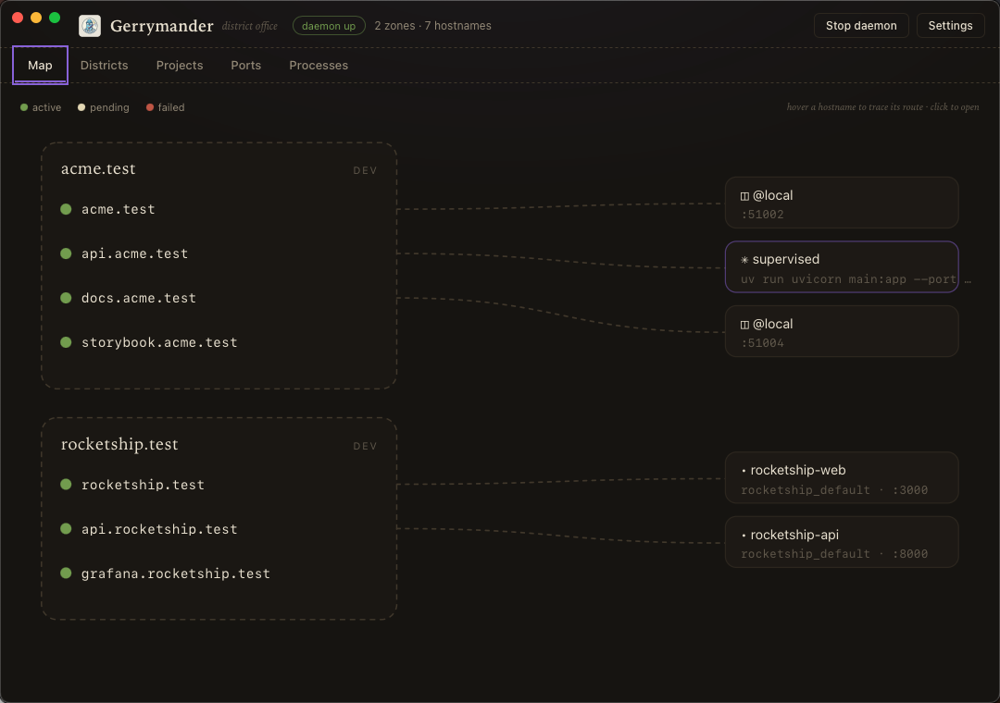
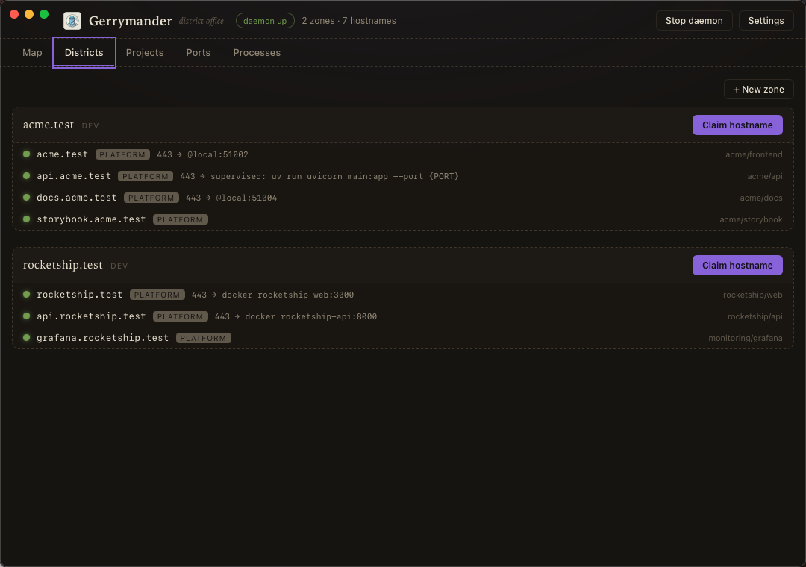

# Quickstart

From nothing to `https://my-app.test` with trusted TLS, and an understanding
of what actually happened.

## 1. Install

```bash
curl -fsSL https://raw.githubusercontent.com/Nano112/gerrymander/main/install.sh | sh
```

One command: platform detected, binary installed, then `gerry bootstrap`
runs automatically: daemon on login, DNS for dev zones, TLS trust. With
brew it's two: `brew install nano112/tap/gerry && gerry bootstrap`.
`GERRY_INSTALL_ONLY=1` skips the bootstrap if you want the pieces
separately (steps 2–3 below are what it does for you).

## 2. Run the daemon

```bash
gerry service install    # launchd on macOS, systemd --user on Linux
gerry status             # doctor: daemon / DNS / proxy / trust checklist
```

The daemon is the registry (SQLite at `~/.gerrymander/gerry.db`), a TLS
proxy with its own local CA, an embedded DNS server for dev TLDs, and a
process supervisor.

## 3. Wire the machine, reversibly

```bash
gerry setup
```

This routes dev TLDs (like `.test`) to gerry's DNS and installs the CA into
your trust store. Every file it writes is marker-tagged; TLDs that already
resolve (dnsmasq, Herd) are skipped, and `gerry uninstall` removes only
gerry's own marks, so it can never break DNS it didn't set up. See
[Coexistence](coexistence.md) for the full interference matrix.

## 4. A project

```bash
cd my-app
gerry init               # writes gerrymander.yaml
```

```yaml
# gerrymander.yaml
project: my-app
zone: my-app.test
services:
  frontend:
    hostnames: [my-app.test]
    dev: "bun run dev"
  api:
    hostnames: [api.my-app.test]
    dev: "uv run uvicorn main:app --port {PORT} --reload"
```

Then either:

```bash
gerry dev                # run everything: ports granted, manifest applied,
                         # prefixed output, group shutdown
```

or, for Vite projects, add the plugin and forget gerry exists:

```js
// vite.config.js
import gerrymander from "gerrymander-vite";
export default { plugins: [gerrymander()] };
```

`bun run dev` now applies the manifest, gets the service's sticky port, and
serves `https://my-app.test` with working HMR over TLS.

## 5. Containers too

```yaml
# docker-compose.yml
services:
  api:
    image: my-api
    labels:
      - gerrymander.hostname=api.my-app.test
      # optional: gerrymander.port=8080, gerrymander.network=mynet
```

`docker compose up` claims the hostname and routes to the container (even
with no published ports; gerry maintains a relay). `down` releases it.

## What just happened

- `my-app.test` and `api.my-app.test` are **allocations** in a local
  registry. `gerry ls` shows them, `gerry rename api.my-app.test api2`
  renames atomically, releasing frees the name.
- Ports are **sticky per owner**: the same service gets the same port
  tomorrow, from a pool that avoids 3000/5173/8000/8080.
- The proxy's 404/502 pages are diagnostic and self-recovering: they tell
  you which backend is down and reload when it returns.

The same registry, with the same semantics, runs in production. See
[Kubernetes](kubernetes.md).

## The desktop app

The Map view traces every hostname to its backend; Districts manages claims;
Ports shows every listener cross-marked with registry grants.




